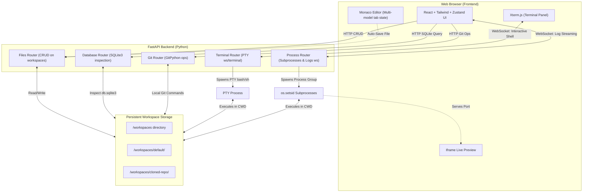

# Cloud IDE 🚀

A premium, full-stack, browser-based Integrated Development Environment (IDE) designed for running Django, Flask, FastAPI, general Python projects, C/C++ compilation, Node.js, and web apps. It features a custom multi-model Monaco Editor, a low-latency interactive pseudo-terminal (PTY), process process-group process monitoring, live real-time log streaming, an integrated SQLite database browser & SQL query executor, split-pane live previews, and Source Control (Git) integration.

---

## 🌟 Key Capabilities

* **Monaco Editor (VS Code Engine)**: Features syntax highlighting for all major languages, smart auto-closing brackets, advanced autocompletion, customizable theme, and a tabbed layout. Each open tab maintains its own isolated editor model, cursor state, and independent undo/redo stack.
* **Low-Latency Terminal (xterm.js + PTY)**: Runs a native pseudo-terminal (`/bin/bash` or `/bin/sh`) on the host/container. Communication occurs over high-speed WebSockets. Controls like window resizing propagate to the server-side PTY automatically.
* **Smart Process Manager & Log Viewer**: Run, stop, and restart services (like dev servers or test runners). Features process-group sandboxing (`preexec_fn=os.setsid`) to clean up orphaned/zombie background processes and release system ports. Real-time log streams reconnect automatically when processes restart.
* **Dynamic Code Runner (`F5` / Play Button)**: Auto-saves active tabs and automatically resolves execution working directories. Detects file extensions to compile/run:
  * **C++ (`.cpp`, `.cc`)**: Compiles with `g++ -Wall -O3` and runs binary.
  * **C (`.c`)**: Compiles with `gcc -Wall -O3` and runs binary.
  * **Python (`.py`)**: Executes script with unbuffered output `python3 -u` (automatically invokes `manage.py runserver` if `manage.py` is open).
  * **Node.js, Go, Rust, and Shell Scripts**: Runs appropriate runtime tools dynamically.
* **SQLite Database Viewer**: Instantly detects SQLite databases in the workspace. Provides a structured table schema inspector, table data browser, and an interactive query panel to run custom SQL queries.
* **Git Integration**: Clone public repositories into your workspace, view modified file diffs in the sidebar, stage and commit changes, and inspect the repository history directly from the GUI.
* **Live Web Preview**: Test your web server using an integrated split-pane iframe previewer with quick-port switcher shortcuts (e.g. `:8000`, `:8001`, `:8080`).

---

## 🏗️ Architecture Flow



---

## ⚙️ Tech Stack & Dependencies

* **Frontend**: React 18, TypeScript, Vite, Tailwind CSS.
* **State Management**: Zustand (stores for files, processes, and UI layout).
* **Editor Component**: `@monaco-editor/react` (configured to support manual, multi-model editor instances).
* **Terminal Engine**: `@xterm/xterm` with `@xterm/addon-fit` and `@xterm/addon-web-links`.
* **Backend**: FastAPI (ASGI python framework) + Uvicorn server.
* **Backend Processes**: standard `asyncio` loop running blocking operations in executors, `subprocess.Popen` with process group session configurations, and native `pty` / `os.read`/`os.write` for shells.
* **Git Operations**: `GitPython` client library.
* **Database Inspection**: `sqlite3` driver.

---

## 🚀 Installation & Startup

### Option A: Running with Docker Compose (Recommended)
This sets up the entire application stack (backend + frontend) in sandboxed containers.

1. Clone this repository to your machine:
   ```bash
   git clone https://github.com/Athmeeya2006/CloudIDE.git
   cd CloudIDE
   ```
2. Copy the sample environment configurations:
   ```bash
   cp backend/.env.example backend/.env
   ```
3. Run docker compose:
   ```bash
   docker compose up --build
   ```
4. Access the web interface at `http://localhost:3000`.

---

### Option B: Local Development Setup
If you want to run the application components natively without Docker containers:

#### 1. Backend API Server
* Ensure Python 3.11+ is installed.
```bash
cd backend
python3 -m venv .venv
source .venv/bin/activate  # On Windows: .venv\Scripts\activate
pip install -r requirements.txt
cp .env.example .env
uvicorn app.main:app --reload --host 0.0.0.0 --port 8000
```

#### 2. Frontend Development Server
* Ensure Node.js 18+ is installed.
```bash
cd frontend
npm install
npm run dev
```
* Access the local frontend app at `http://localhost:5173`.

---

## 🔧 Environment Configurations

### Backend Settings (`backend/.env`)

| Variable | Default Value | Description |
|:---|:---|:---|
| `WORKSPACE_PATH` | `/workspaces` | Directory where all client workspace files and cloned repositories reside. |
| `ALLOWED_ORIGINS` | `["http://localhost:5173", "http://localhost:3000"]` | CORS origin list allowed to communicate with the REST & WS APIs. |
| `MAX_PROCESSES` | `10` | Maximum number of concurrent background processes allowed to run. |
| `PORT` | `8000` | Port on which the FastAPI server listens. |

### Frontend Settings (`frontend/.env.local`)

| Variable | Default Value | Description |
|:---|:---|:---|
| `VITE_API_URL` | *(empty, proxies locally via Vite)* | Production API server URL. |
| `VITE_WS_URL` | `ws://localhost:8000` | WebSocket endpoint used for terminal and log streams. |

---

## 📖 Deep-Dive Feature Mechanics

### 1. Monaco Editor Multi-Model Synchronisation
To support independent file tabs with isolated undo history, copy-paste buffers, and cursor locations, the frontend manually creates and swaps Monaco Text Models:
```typescript
model = monacoHook.editor.createModel(
  initialContent,
  getLanguage(filename),
  monacoHook.Uri.file(filepath)
);
```
* **Avoiding Cursor Jumps**: Traditional Monaco-React implementations overwrite model value state upon every keystroke, which resets cursor focus and destroys the undo stack. Cloud IDE uses a `lastStoreContentRef` that tracks the local editor inputs. The backend store value only updates the Monaco model if it differs from the ref (meaning the change occurred externally, like a Git branch pull or terminal file write).
* **Auto-Closing Brackets**: Autocomplete snippets, tab indentations, and parentheses matching execute natively inside the Monaco sandbox, maintaining instant, lag-free UI typing.

### 2. Process Group Sandboxing (`os.setsid`)
FastAPI executes commands in shell mode (`shell=True`), launching a process tree. In default systems, killing the parent shell leaves the child script (like a Django server on port `8001`) running as a zombie. 
* Cloud IDE executes subprocesses inside their own process group by setting `preexec_fn=os.setsid` at launch.
* When you terminate or restart an execution, the backend terminates the **entire process group** using `os.killpg(os.getpgid(self.proc.pid), signal.SIGTERM)`. This safely releases any allocated sockets and cleans up all descendants.

### 3. Real-Time Terminal Keystroke Protection
Websockets capture typing keystrokes from `xterm.js` and transmit them to the server-side pseudoterminal. 
* Some terminal payloads (e.g. typing number keys, brackets, or boolean statements) format as valid JSON primitives (such as `"1"` or `"true"`).
* The backend parses incoming websocket messages. We verify if the payload is a control command (like a resize JSON message) using strict dictionary checks (`isinstance(ctrl, dict)`) before evaluating control types. This prevents crashes due to unhandled `AttributeError` exceptions and keeps python shells and input prompts working smoothly.

---

## 🛠️ Extending Support to Additional Runtimes

The Cloud IDE environment is modular and designed to easily integrate new development SDKs:

1. **Install runtimes in the Backend Container** (`backend/Dockerfile`):
   ```dockerfile
   # Example: Installing Node.js, Go, and Rust compilers
   RUN apt-get update && apt-get install -y --no-install-recommends \
       nodejs npm golang rustc cargo
   ```
2. **Add Execution Presets in the GUI**:
   Open `EditorArea.tsx` and register the file extension mappings in `handleRun()`. The editor automatically saves files, routes working paths, compiles, and streams the process terminal logs:
   ```typescript
   // Example extension runner map
   if (ext === 'rs') {
     command = `rustc "${filename}" && "./${out}"`;
   } else if (ext === 'go') {
     command = `go run "${filename}"`;
   }
   ```

---

## 📂 Repository Directory Layout

```
.
├── backend/
│   ├── app/
│   │   ├── main.py          # FastAPI application server entrypoint
│   │   ├── config.py        # Application settings and Pydantic validation
│   │   └── routers/
│   │       ├── files.py     # Filesystem CRUD router
│   │       ├── terminal.py  # WebSocket interactive PTY terminal router
│   │       ├── processes.py # Subprocess management and logging socket
│   │       ├── database.py  # SQLite reader & SQL executor router
│   │       └── git.py       # Source Control wrapper (GitPython)
│   ├── requirements.txt     # Python dependencies
│   └── Dockerfile           # Backend container setup
├── frontend/
│   ├── src/
│   │   ├── components/
│   │   │   ├── Sidebar/       # Git, File Explorer, DB schema viewer
│   │   │   ├── Editor/        # Monaco code space & editor tabs
│   │   │   ├── BottomPanel/   # Logs, interactive Terminal, SQL Query runner
│   │   │   └── Preview/       # Integrated web view preview
│   │   ├── stores/            # Zustand state containers (files, processes, ui)
│   │   ├── api/               # Axiom connection client
│   │   └── utils/             # Helpers (language mapping, units)
│   ├── Dockerfile             # Production build & nginx frontend container
│   └── tsconfig.json          # TypeScript compilation settings
├── docker-compose.yml         # Container orchestrator
└── README.md                  # Comprehensive Documentation
```

---

## ⚖️ License

Distributed under the MIT License. See `LICENSE` for details.
