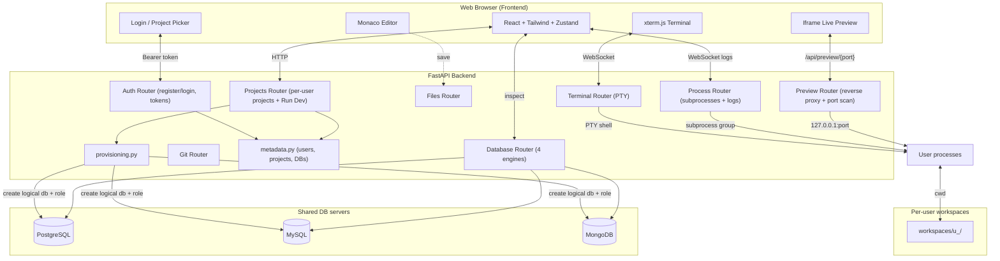

# Cloud IDE 🚀

A multi-user, browser-based development environment. Each user signs in with email and password, owns their own projects, and gets a full toolchain: a multi-model Monaco editor, an interactive PTY terminal over WebSockets, managed processes with streamed logs, a one-click full-stack runner, a live preview that works even on a remote host, a database viewer across SQLite/PostgreSQL/MySQL/MongoDB, and Git integration.

---

## 🌟 Core Capabilities

* **Accounts and projects**: email/password sign-in (PBKDF2-hashed, signed-token sessions). Each user owns isolated projects; every project has its own workspace folder and provisioned databases.
* **Multi-engine databases**: provision a SQLite, PostgreSQL, MySQL, or MongoDB database per project. A handful of shared servers back thousands of per-project logical databases (see below). The unified viewer lists tables/collections, schema, paginated rows, and a read-only query runner.
* **Monaco editor (VS Code engine)**: syntax highlighting, bracket matching, parameter hints, formatting, and a tabbed layout with independent models, cursor positions, and undo/redo stacks.
* **Interactive PTY terminal (xterm.js)**: a real shell streamed bi-directionally over WebSockets, with size negotiation. Each terminal opens inside the current project folder.
* **Run button + one-click Run Dev**: F5 runs the active file; **Run Dev** auto-detects and starts a project's services (backend + frontend) at once, with framework-aware commands and a low-memory build-and-serve mode.
* **Live preview (works remotely)**: an iframe routed through a backend reverse proxy, so it reaches your app even when the IDE backend runs on a different machine than your browser. Auto-detects whichever port your app is actually on.
* **Managed processes**: start/stop/restart background servers with streamed stdout/stderr logs.
* **Git**: init, clone, status, diff, commit, push, pull, log, and branches.

---

## 🏗️ Architecture Design



---

## 🗄️ Accounts, Projects, and Multi-Engine Databases

* **Email/password accounts**: users sign in and own their own set of projects. Passwords are salted and hashed with PBKDF2, and sessions use signed tokens.
* **Per-user projects**: each project has its own workspace directory and its own provisioned databases. The file explorer, terminal, processes, Git, and database viewer all operate within the selected project.
* **Databases across four engines**: a project can be provisioned a SQLite, PostgreSQL, MySQL, or MongoDB database. The IDE shares one PostgreSQL, one MySQL, and one MongoDB server across all users and creates a single logical database (named `proj_<projectId>`) per project on first use, rather than running a server per user. SQLite projects get a plain `app.db` file in the workspace with no server involved. Each project receives a dedicated database role and a generated password scoped to only its own database, so projects sharing a server cannot read each other's data. `MAX_DATABASES_PER_USER` limits how many databases a user can create.
* **Unified database viewer**: list tables (or Mongo collections), inspect schema, browse rows with pagination, and run read-only queries, with the same interface for every engine.
* **Live preview with CRUD**: run your app, open it in the Live Preview, and creating or deleting records through its UI updates the rows shown in the Database Viewer. The provisioned database connection string is available to your app through `DATABASE_URL`.

> **Ports and preview:** the IDE backend uses port `8000` and the IDE frontend uses `3000`, so do not run your own apps on those. Bind your app to `0.0.0.0`. The Live Preview reaches your app through a backend proxy (`/api/preview/<port>/`), so it works even when the IDE runs on a different machine than your browser, and it auto-detects whichever port your app is on. Single-page apps must serve their assets under that base path; **Run Dev sets this automatically** for detected Vite / CRA / Next apps (Vite `--base`, CRA `PUBLIC_URL`). If you start a frontend by hand, pass the same base (for example `vite --base /api/preview/5173/`). WebSockets are not proxied, so dev-server hot reload does not push updates; use the reload button.

Implementation lives in `backend/app/metadata.py` (users, projects, and their databases), `backend/app/provisioning.py` (creating and tearing down databases and roles), and `backend/app/db_inspect.py` (read-only browsing across all engines).

---

## 🧩 Running Projects (single scripts and full-stack apps)

**You never type `cd` by hand.** Every terminal opens inside the current project's
folder, so you can run commands directly. The green **Run** button adds the
`cd` itself, only so it also works when the active file lives in a subfolder.

### A single file
Open the file and press **Run** (or F5), or just type the command in the
terminal, for example `python main.py` or `node index.js`.

### A backend server
A server is a long-running process, so start it in a terminal and leave it
running. Bind to `0.0.0.0` and use a port other than `8000`/`3000`.

```bash
# FastAPI (fastapi/uvicorn are pre-installed in the IDE image)
uvicorn main:app --host 0.0.0.0 --port 5000 --reload

# Flask
flask run --host 0.0.0.0 --port 5000

# Node/Express
node server.js        # make the app listen on 0.0.0.0:5000
```

### A frontend dev server
Open a **second terminal** (use the `+` in the terminal panel) so the backend
keeps running, then start the frontend with an explicit host and port.

```bash
npm install
npm run dev -- --host --port 5173      # Vite/React
# Create React App: HOST=0.0.0.0 PORT=5173 npm start
```

If your repo has `frontend/` and `backend/` subfolders, `cd frontend` /
`cd backend` first. You are already at the project root in each terminal.

### One click: the Run Dev button
The title bar has a **Run Dev** button that starts every service for the project
at once, opens the Processes panel, and points the Preview at the first service
that exposes a port. The dropdown next to it lists the services and lets you
start them individually.

It decides what to run in one of two ways:

* **`cloudide.json`** at the project root (authoritative). Define your services:
  ```json
  {
    "services": [
      { "name": "backend",  "command": "uvicorn main:app --host 0.0.0.0 --port 5000 --reload", "cwd": "backend",  "port": 5000 },
      { "name": "frontend", "command": "npm run dev -- --host --port 5173",                      "cwd": "frontend", "port": 5173 }
    ]
  }
  ```
  `cwd` is relative to the project root, and `port` is the port the Preview opens.
* **Auto-detection** when there is no config. The IDE scans the project root and
  its immediate subfolders for `package.json` (runs `npm run dev`/`npm start`),
  Node entry files (`server.js`, `index.js`), `manage.py` (Django), and common
  Python entrypoints (`main.py`, `app.py`, `server.py`, `run.py`, or a lone
  `.py` file), assigning non-conflicting ports. If nothing is detected, Run Dev
  runs the file currently open in the editor.

Use **Save as config** in the Run Dev dropdown to write the current services to
`cloudide.json` so they become fixed and editable.

### Low-memory mode (small instances)
A Create React App / webpack dev server can use more RAM than a small instance
has, and get OOM-killed mid-build. When the host has under ~1 GiB of RAM (or you
set `LOW_MEMORY=true`), Run Dev switches known frameworks from a dev server to a
one-time production build that is then served statically, which uses far less
memory at runtime:

* Vite: `npm run build && vite preview`
* Create React App: `npm run build && serve -s build` (source maps off, capped Node heap)
* Next.js: `npm run build && next start`

The Run Dev dropdown shows a **build mode** badge when this is active. npm installs
always run with `--legacy-peer-deps`, so peer-dependency conflicts never block
them. If your app keeps running out of memory, prefer Vite over CRA (much lighter)
or move to a larger instance.

### Full-stack, end to end (manual)
1. Terminal 1: start the backend on `0.0.0.0:5000`.
2. Terminal 2: start the frontend on `0.0.0.0:5173`.
3. Point your frontend's API calls at the backend (for example
   `http://localhost:5000`) and enable CORS for it in the backend.
4. Open the **Preview** panel and select port `5173` (or type the URL). The
   address bar always shows the exact host being previewed.
5. Edits reload in the preview: backends with `--reload` and Vite's HMR refresh
   automatically; otherwise click reload in the preview toolbar.

You can also run servers from the **Processes** panel instead of a terminal,
which gives each one a start/stop/restart control and a streamed log view.

> Reminder: ports `8000` (IDE backend) and `3000` (IDE frontend) are taken. Use
> `5173`, `5000`, `5001`-`5010`, or `8080`, and bind to `0.0.0.0`.

---

## ⚙️ Tech Stack & Dependencies

* **Frontend**: React 18, TypeScript, Vite, Tailwind CSS, Radix UI Context Menu.
* **State Management**: Zustand stores (fileStore, processStore, uiStore).
* **Code Editor**: `@monaco-editor/react` (configured to support manual, multi-model editor instances).
* **Terminal Engine**: `@xterm/xterm` with `@xterm/addon-fit`, `@xterm/addon-web-links`, and `@xterm/addon-unicode11`.
* **Backend**: FastAPI (Python) + Uvicorn ASGI server.
* **Backend Shells**: Standard library PTY (`pty`, `os`, `fcntl`, `termios`) for WebSocket-based interactive shell sessions.
* **Auth**: standard-library PBKDF2 password hashing + HMAC-signed tokens (no external auth library).
* **Databases**: `sqlite3` (stdlib), `psycopg2` (PostgreSQL), `PyMySQL`, `pymongo`, all imported lazily.
* **Preview proxy**: `httpx` streaming reverse proxy.
* **Git Actions**: The system `git` binary, invoked via `asyncio.create_subprocess_exec` (no third-party Git client).

---

## 🚀 Installation & Startup

### Option A: Using Docker Compose (Recommended)
Builds and runs frontend and backend containers in an isolated network:

1. Clone the repository:
   ```bash
   git clone https://github.com/Athmeeya2006/CloudIDE.git
   cd CloudIDE
   ```
2. Set up backend environment variables:
   ```bash
   cp backend/.env.example backend/.env
   ```
3. Run the docker containers:
   ```bash
   docker compose up --build
   ```
4. Access the Cloud IDE at `http://localhost:3000`.

---

### Option B: Local Native Setup
To run the components natively on your host machine:

#### 1. Backend Server Setup
* Make sure Python 3.11+ is installed.
```bash
cd backend
python3 -m venv .venv
source .venv/bin/activate  # Windows: .venv\Scripts\activate
pip install -r requirements.txt
cp .env.example .env
uvicorn app.main:app --reload --host 0.0.0.0 --port 8000
```

#### 2. Frontend Server Setup
* Make sure Node.js 18+ is installed.
```bash
cd frontend
npm install
npm run dev
```
* Access the local development server at `http://localhost:5173`.

---

## 🔧 Environment Configuration

### Backend Settings (`backend/.env`)

| Variable | Default | Description |
|:---|:---|:---|
| `WORKSPACE_BASE` | `/workspaces` | Root for all workspace files. Falls back to `<repo>/workspaces` if not writable. |
| `ALLOWED_ORIGINS` | `localhost:5173,3000,...` | Comma-separated CORS origins for REST and WebSocket access. |
| `MAX_PROCESSES` | `10` | Max concurrent background processes. |
| `PORT` | `8000` | Port the FastAPI server binds to (a platform like Render sets this). |
| `AUTH_SECRET` | random per process | Secret for signing session tokens. Set a fixed value so tokens survive restarts. |
| `LOW_MEMORY` | `false` | Force build-and-serve mode. Auto-enabled under ~1 GiB RAM. |
| `RESERVED_PORTS` | empty | Extra ports the preview must never treat as a user app (comma-separated). |
| `MAX_DATABASES_PER_USER` | `20` | Per-user quota on provisioned databases. |
| `PG_HOST` / `PG_PORT` / `PG_ADMIN_USER` / `PG_ADMIN_PASSWORD` | empty / `5432` / ... | Shared PostgreSQL server. Empty `PG_HOST` disables PostgreSQL. |
| `MYSQL_HOST` / `MYSQL_PORT` / `MYSQL_ADMIN_USER` / `MYSQL_ADMIN_PASSWORD` | empty / `3306` / ... | Shared MySQL server. Empty host disables MySQL. |
| `MONGO_HOST` / `MONGO_PORT` / `MONGO_ADMIN_USER` / `MONGO_ADMIN_PASSWORD` | empty / `27017` / ... | Shared MongoDB server. Empty host disables MongoDB. |

`docker-compose.yml` sets the `*_HOST` values to its bundled database services, so all four engines work out of the box under Compose.

### Frontend Settings (`frontend/.env`)

| Variable | Default | Description |
|:---|:---|:---|
| `VITE_API_URL` | empty | Backend base URL. **Empty = same origin** (works under Compose/nginx and local Vite proxy). For a split deployment (frontend and backend on different domains) set this to the backend URL. |
| `VITE_WS_URL` | empty | WebSocket base URL. Empty derives `ws(s)://` from `VITE_API_URL` or the page origin. |

---

## 🌐 Deployment

### Docker Compose (single host, recommended)
`docker compose up --build` brings up the frontend (nginx on port 3000), the
backend (port 8000), and the three shared database servers on one network. nginx
proxies `/api` (including WebSockets and the preview proxy) to the backend, so
`VITE_API_URL` stays empty (same origin). User apps run inside the backend
container and are reached by the preview proxy over `127.0.0.1`.

### Split deployment (frontend and backend on different hosts)
For example, the frontend on Vercel and the backend on Render:

1. **Backend** (Render web service from `backend/Dockerfile`): a single public
   port. Set `AUTH_SECRET`, the `*_HOST` database vars (or leave empty to use
   SQLite only), and `ALLOWED_ORIGINS` to include the frontend's URL.
2. **Frontend** (Vercel from `frontend/`): set `VITE_API_URL` to the backend's
   public URL. Every request, including the terminal WebSocket and the preview
   proxy, then targets the backend.

Key point for previews in a split deployment: user apps run inside the **backend**
container and are never exposed as public ports. The browser reaches them only
through the backend proxy at `VITE_API_URL` + `/api/preview/<port>/`. There is
nothing to expose per port, and the app can listen on any port.

---

## 🩺 Troubleshooting

* **Preview says "Nothing is running on port N".** That page is served by the
  backend proxy, so the request reached the backend fine; nothing is listening
  on that port yet. Check the **Processes** panel: if it still shows `npm install`
  or a build, just wait; if you see `Killed`, it ran out of memory.
* **The dev server gets OOM-killed (Render "memory limit exceeded").** The app is
  too heavy for the instance (CRA/webpack is the usual culprit). Low-memory mode
  builds and serves instead; prefer Vite over CRA, or use a larger instance.
* **The app is on a different port than the preview opened.** The preview scans
  the host's listening sockets and switches to your app automatically; or click
  the radar (detect) button, or type the port in the address bar.
* **`npm warn ERESOLVE` / peer dependency conflicts.** These are warnings, not
  errors; the install continues. Auto-detected installs already pass
  `--legacy-peer-deps`.
* **Login/terminal/preview fail on a split deployment.** `VITE_API_URL` is not
  pointing at the backend, so requests hit the frontend origin. Set it on the
  frontend host and make sure the backend's `ALLOWED_ORIGINS` includes the
  frontend URL.

---

## 📖 Deep-Dive Feature Mechanics & Implementation

### 1. Monaco Editor Multi-Model Coordination
To provide high-performance tab switching with independent undo histories and selections, Cloud IDE avoids mounting new editor components. Instead, we create a single editor instance and swap `ITextModel` elements:
```typescript
model = monacoHook.editor.createModel(
  initialContent,
  getLanguage(filename),
  monacoHook.Uri.file(filepath)
);
```
* **Preserving Cursor Position and History**: Standard inputs write to state directly, resetting cursor positions on updates. Cloud IDE tracks local edits with a `lastStoreContentRef` value. If the store's code updates externally (e.g. git pulls or file updates), the Monaco model is updated via `pushEditOperations` to merge external content without resetting user scroll coordinates or erasing undo buffers.

### 2. PTY Terminal Code Running (F5 / Play button)
Instead of executing code in a separate, isolated background runner, Cloud IDE runs script execution directly inside the user's interactive xterm.js terminal instance to support console inputs (stdin).
* **Command Resolver**: `EditorArea.tsx` detects the active file extension and returns compile/run presets (e.g., `python3 -u "script.py"` or compilation commands `g++ -Wall -O2 -o "app" "app.cpp" && "./app"`).
* **Event Dispatching**: When F5 is triggered, the IDE dispatches a custom `run-in-terminal` event:
  ```typescript
  const event = new CustomEvent('run-in-terminal', {
    detail: { command: runConfig.command }
  });
  window.dispatchEvent(event);
  ```
* **PTY WebSocket Transmission**: `TerminalPanel.tsx` listens for the `run-in-terminal` event. It first sends `\x03` (Ctrl+C interrupt) to cancel any active terminal executions, followed by a slight timeout (150ms) to allow the shell to clear, and then transmits the resolved run command followed by a carriage return (`\r`):
  ```typescript
  const handleRunInTerminal = (e: Event) => {
    const cmd = (e as CustomEvent).detail?.command;
    if (cmd && ws.readyState === WebSocket.OPEN) {
      ws.send('\x03'); // Interrupt active execution
      setTimeout(() => {
        ws.send(cmd + '\r'); // Submit new command
      }, 150);
    }
  };
  ```

### 3. Process Group Isolation (`os.setsid`)
FastAPI executes background services using shell commands, producing subprocess trees. Standard environments leaving parent terminals running can spawn orphaned/zombie processes.
* Cloud IDE handles this by launching subprocesses in distinct sessions with `preexec_fn=os.setsid`.
* Terminations target the entire process group using `os.killpg(os.getpgid(self.proc.pid), signal.SIGTERM)`, cleaning up child tasks and freeing associated network ports.

### 4. Keystroke Protection in WebSocket Terminals
Xterm keystrokes are transmitted as raw streams. To prevent typing integers or booleans from colliding with control structures (e.g. window resize actions):
* The backend verifies whether WebSocket payloads contain structured control commands using precise dictionary checking (`isinstance(ctrl, dict)`) before running key parsing operations. This avoids crashes and keeps interactive interpreters (like python prompt inputs) running smoothly.

---

## 🛠️ Extending Support to Additional Runtimes

The Cloud IDE environment is modular and designed to easily integrate new development SDKs:

1. **Install Runtimes in the Backend Container** (`backend/Dockerfile`):
   ```dockerfile
   # Example: Installing Node.js, Go, and Rust compilers
   RUN apt-get update && apt-get install -y --no-install-recommends \
       nodejs npm golang rustc cargo
   ```
2. **Add Execution Presets in the GUI**:
   Open `EditorArea.tsx` and register the file extension mappings in `getRunConfig()`. The editor automatically saves files, routes working paths, compiles, and streams the process terminal logs:
   ```typescript
   // Example extension runner map
   const runners: Record<string, { command: string; displayName: string }> = {
     py: { command: `python3 -u "${filename}"`, displayName: `Python: ${filename}` },
     rs: { command: `rustc "${filename}" -o "${base}" && "./${base}"`, displayName: `Rust: ${filename}` },
     go: { command: `go run "${filename}"`, displayName: `Go: ${filename}` },
   };
   ```

---

## 📂 Project Directory Structure

```
.
├── backend/
│   ├── app/
│   │   ├── main.py           # FastAPI app: routers, lifespan, middleware
│   │   ├── config.py         # Settings (env-driven)
│   │   ├── security.py       # Path-traversal / workspace validation
│   │   ├── auth.py           # PBKDF2 password hashing + HMAC tokens
│   │   ├── metadata.py       # Control-plane SQLite: users, projects, databases
│   │   ├── provisioning.py   # Create/destroy per-project logical databases
│   │   ├── db_inspect.py     # Read-only browsing across all 4 engines
│   │   ├── runner.py         # Run Dev: cloudide.json + auto-detection + low-memory
│   │   └── routers/
│   │       ├── auth.py       # register / login / me
│   │       ├── projects.py   # per-user projects, services, databases
│   │       ├── files.py      # filesystem CRUD
│   │       ├── terminal.py   # WebSocket interactive PTY
│   │       ├── processes.py  # subprocess management + log stream
│   │       ├── database.py   # database viewer (engine-aware)
│   │       ├── git.py        # git via subprocess
│   │       └── preview.py    # reverse proxy + port detection
│   ├── tests/                # Pytest suite
│   └── Dockerfile            # Backend image (python, node/npm, sudo, db drivers)
├── frontend/
│   ├── src/
│   │   ├── components/
│   │   │   ├── Auth/          # LoginScreen, ProjectPicker
│   │   │   ├── Sidebar/       # Explorer, Search, Git, Database panels
│   │   │   ├── Editor/        # Monaco editor, tabs, run config
│   │   │   ├── BottomPanel/   # Terminal, Processes/Logs, Database viewer
│   │   │   ├── Preview/       # Live preview (proxy + auto-detect)
│   │   │   └── RunDevButton.tsx
│   │   ├── stores/            # Zustand: auth, project, file, process, ui
│   │   └── api/client.ts      # Axios client + auth/projects/preview helpers
│   └── Dockerfile             # Frontend production image (nginx)
├── docker-compose.yml         # Backend, frontend, postgres, mysql, mongo
└── README.md
```

---

## ✅ Testing

**Backend** (FastAPI / pytest) covers files, git, database, processes, the interactive PTY terminal, and the path-security helpers:
```bash
cd backend
python3 -m venv venv && source venv/bin/activate
pip install -r requirements-dev.txt
pytest -q
```

**Frontend** (Vitest) covers utility helpers, the Zustand stores, the fuzzy file matcher, and the diff parser:
```bash
cd frontend
npm install
npm test          # one-shot run
npm run type-check
npm run lint      # ESLint (strict: zero warnings allowed)
```

CI (`.github/workflows/ci.yml`) runs ruff + pytest, the frontend type-check + ESLint + Vitest, and a Docker build check on every push and PR.

---

## 🔒 Security & Production Hardening

* **Path-traversal protection**: every user-supplied path and workspace name is funneled through `app/security.py`, which strips null bytes and rejects any path that escapes the workspace root (verified by resolving symlinks before an `is_relative_to` check). Workspace names must be single, non-dot path segments.
* **File tree limits**: the explorer skips heavy/machine-generated directories (`node_modules`, `.git`, `venv`, `dist`, build caches, …) and is bounded by node-count and depth limits so a pathological project can't produce an unbounded response. File reads over 5 MB are refused.
* **Read-only SQL viewer**: the query endpoint opens SQLite connections in `mode=ro`, so writes are impossible at the engine level regardless of the SQL submitted; a keyword pre-check returns a friendly message. Table names are validated against an identifier allowlist.
* **Git clone safety**: repository URLs are validated against an allowlist of schemes and passed after a `--` separator, preventing argument-injection (e.g. a URL beginning with `-`).
* **Upload limits**: a middleware rejects request bodies over 50 MB and malformed `Content-Length` headers.
* **Offline-capable editor**: Monaco and its language web workers are bundled locally (no runtime CDN dependency), so the editor works behind a strict CSP or with no internet access.
* **Deployment note**: this IDE executes arbitrary user code and shell commands by design. Run it inside an isolated, sandboxed container (as the provided non-root `ide` user) and never expose it directly to untrusted users on a shared host.


