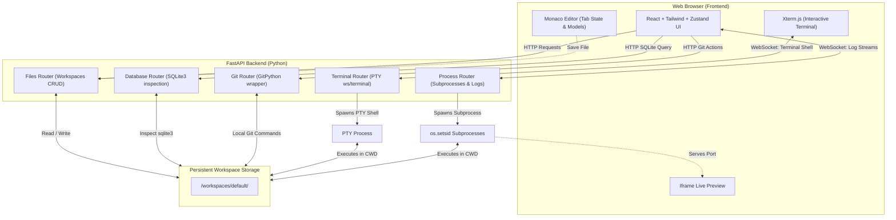

# Cloud IDE 🚀

A high-performance, browser-based Integrated Development Environment (IDE) tailored for Python projects, Node.js, C/C++ compilation, and modern web applications. Cloud IDE packages a multi-model Monaco Editor, a low-latency interactive pseudo-terminal (PTY) over WebSockets, custom process sandboxing, real-time log streaming, an integrated SQLite database visualizer, and full Git integration.

---

## 🌟 Core Capabilities

* **Monaco Editor (VS Code Engine)**: Support for syntax highlighting, bracket matching, parameter hints, and code formatting. Tabbed layout handles independent editor models, maintaining cursor positions, selections, and individual undo/redo stacks.
* **Low-Latency Interactive PTY (xterm.js)**: Runs a backend pseudo-terminal (PTY) shell (like bash or sh) directly on the host. Keystrokes are streamed bi-directionally over WebSockets, with automatic terminal size negotiation.
* **Direct Terminal Code Runner (F5 / Play Button)**: Intercepts active files, resolves compilers (gcc, g++, python3, node, ts-node, etc.), and runs commands directly in the interactive terminal panel.
* **Integrated SQLite Visualizer**: Automatically parses SQLite database files within the workspace. Provides a structured database schema viewer, table browsers, and a custom SQL query executor.
* **Git Version Control**: Clean visual interfaces to clone repositories, view status badges (modified, added, deleted), see file diff overlays, write commit messages, and browse repository commit history.
* **Live Web Preview**: Split-pane iframe viewer with quick-port switcher buttons to test localhost web servers (e.g. ports 3000, 8000, 8080) directly in the workspace.

---

## 🏗️ Architecture Design



---

## 🗄️ Accounts, Projects, and Multi-Engine Databases

* **Email/password accounts**: users sign in and own their own set of projects. Passwords are salted and hashed with PBKDF2, and sessions use signed tokens.
* **Per-user projects**: each project has its own workspace directory and its own provisioned databases. The file explorer, terminal, processes, Git, and database viewer all operate within the selected project.
* **Databases across four engines**: a project can be provisioned a SQLite, PostgreSQL, MySQL, or MongoDB database. The IDE shares one PostgreSQL, one MySQL, and one MongoDB server across all users and creates a single logical database (named `proj_<projectId>`) per project on first use, rather than running a server per user. SQLite projects get a plain `app.db` file in the workspace with no server involved. Each project receives a dedicated database role and a generated password scoped to only its own database, so projects sharing a server cannot read each other's data. `MAX_DATABASES_PER_USER` limits how many databases a user can create.
* **Unified database viewer**: list tables (or Mongo collections), inspect schema, browse rows with pagination, and run read-only queries, with the same interface for every engine.
* **Live preview with CRUD**: new projects are scaffolded with a runnable FastAPI and HTML CRUD app wired to the provisioned database through `DATABASE_URL`. Run `python main.py`, open the Live Preview to use it, and creating or deleting records in the UI updates the rows shown in the Database Viewer.

Implementation lives in `backend/app/metadata.py` (users, projects, and their databases), `backend/app/provisioning.py` (creating and tearing down databases and roles), and `backend/app/db_inspect.py` (read-only browsing across all engines).

---

## ⚙️ Tech Stack & Dependencies

* **Frontend**: React 18, TypeScript, Vite, Tailwind CSS, Radix UI Context Menu.
* **State Management**: Zustand stores (fileStore, processStore, uiStore).
* **Code Editor**: `@monaco-editor/react` (configured to support manual, multi-model editor instances).
* **Terminal Engine**: `@xterm/xterm` with `@xterm/addon-fit`, `@xterm/addon-web-links`, and `@xterm/addon-unicode11`.
* **Backend**: FastAPI (Python) + Uvicorn ASGI server.
* **Backend Shells**: Standard library PTY (`pty`, `os`, `fcntl`, `termios`) for WebSocket-based interactive shell sessions.
* **Git Actions**: The system `git` binary, invoked via `asyncio.create_subprocess_exec` (no third-party Git client).

---

## 🚀 Installation & Startup

### Option A: Using Docker Compose (Recommended)
Builds and runs frontend and backend containers in an isolated network:

1. Clone the repository:
   ```bash
   git clone https://github.com/Athmeeya2006/CloudIDE.git
   cd CloudIDE
   ```
2. Set up backend environment variables:
   ```bash
   cp backend/.env.example backend/.env
   ```
3. Run the docker containers:
   ```bash
   docker compose up --build
   ```
4. Access the Cloud IDE at `http://localhost:3000`.

---

### Option B: Local Native Setup
To run the components natively on your host machine:

#### 1. Backend Server Setup
* Make sure Python 3.11+ is installed.
```bash
cd backend
python3 -m venv .venv
source .venv/bin/activate  # Windows: .venv\Scripts\activate
pip install -r requirements.txt
cp .env.example .env
uvicorn app.main:app --reload --host 0.0.0.0 --port 8000
```

#### 2. Frontend Server Setup
* Make sure Node.js 18+ is installed.
```bash
cd frontend
npm install
npm run dev
```
* Access the local development server at `http://localhost:5173`.

---

## 🔧 Environment Configuration

### Backend Settings (`backend/.env`)

| Variable | Default Value | Description |
|:---|:---|:---|
| `WORKSPACE_BASE` | `/workspaces` | Directory where all client workspace files reside. Falls back to `<repo>/workspaces` if not writable. |
| `ALLOWED_ORIGINS` | `http://localhost:5173,http://localhost:3000` | Comma-separated list of CORS origins permitted to access REST & WebSocket servers. |
| `MAX_PROCESSES` | `10` | Maximum number of concurrent background tasks. |
| `PORT` | `8000` | Port for the FastAPI server to bind to. |

### Frontend Settings (`frontend/.env`)

| Variable | Default Value | Description |
|:---|:---|:---|
| `VITE_API_URL` | `http://localhost:8000` | REST API base URL. Leave empty to use the same origin (e.g. behind the nginx reverse proxy). |
| `VITE_WS_URL` | `ws://localhost:8000` | WebSocket base URL. Leave empty to derive `ws(s)://` from the page origin. |

---

## 📖 Deep-Dive Feature Mechanics & Implementation

### 1. Monaco Editor Multi-Model Coordination
To provide high-performance tab switching with independent undo histories and selections, Cloud IDE avoids mounting new editor components. Instead, we create a single editor instance and swap `ITextModel` elements:
```typescript
model = monacoHook.editor.createModel(
  initialContent,
  getLanguage(filename),
  monacoHook.Uri.file(filepath)
);
```
* **Preserving Cursor Position and History**: Standard inputs write to state directly, resetting cursor positions on updates. Cloud IDE tracks local edits with a `lastStoreContentRef` value. If the store's code updates externally (e.g. git pulls or file updates), the Monaco model is updated via `pushEditOperations` to merge external content without resetting user scroll coordinates or erasing undo buffers.

### 2. PTY Terminal Code Running (F5 / Play button)
Instead of executing code in a separate, isolated background runner, Cloud IDE runs script execution directly inside the user's interactive xterm.js terminal instance to support console inputs (stdin).
* **Command Resolver**: `EditorArea.tsx` detects the active file extension and returns compile/run presets (e.g., `python3 -u "script.py"` or compilation commands `g++ -Wall -O2 -o "app" "app.cpp" && "./app"`).
* **Event Dispatching**: When F5 is triggered, the IDE dispatches a custom `run-in-terminal` event:
  ```typescript
  const event = new CustomEvent('run-in-terminal', {
    detail: { command: runConfig.command }
  });
  window.dispatchEvent(event);
  ```
* **PTY WebSocket Transmission**: `TerminalPanel.tsx` listens for the `run-in-terminal` event. It first sends `\x03` (Ctrl+C interrupt) to cancel any active terminal executions, followed by a slight timeout (150ms) to allow the shell to clear, and then transmits the resolved run command followed by a carriage return (`\r`):
  ```typescript
  const handleRunInTerminal = (e: Event) => {
    const cmd = (e as CustomEvent).detail?.command;
    if (cmd && ws.readyState === WebSocket.OPEN) {
      ws.send('\x03'); // Interrupt active execution
      setTimeout(() => {
        ws.send(cmd + '\r'); // Submit new command
      }, 150);
    }
  };
  ```

### 3. Process Group Isolation (`os.setsid`)
FastAPI executes background services using shell commands, producing subprocess trees. Standard environments leaving parent terminals running can spawn orphaned/zombie processes.
* Cloud IDE handles this by launching subprocesses in distinct sessions with `preexec_fn=os.setsid`.
* Terminations target the entire process group using `os.killpg(os.getpgid(self.proc.pid), signal.SIGTERM)`, cleaning up child tasks and freeing associated network ports.

### 4. Keystroke Protection in WebSocket Terminals
Xterm keystrokes are transmitted as raw streams. To prevent typing integers or booleans from colliding with control structures (e.g. window resize actions):
* The backend verifies whether WebSocket payloads contain structured control commands using precise dictionary checking (`isinstance(ctrl, dict)`) before running key parsing operations. This avoids crashes and keeps interactive interpreters (like python prompt inputs) running smoothly.

---

## 🛠️ Extending Support to Additional Runtimes

The Cloud IDE environment is modular and designed to easily integrate new development SDKs:

1. **Install Runtimes in the Backend Container** (`backend/Dockerfile`):
   ```dockerfile
   # Example: Installing Node.js, Go, and Rust compilers
   RUN apt-get update && apt-get install -y --no-install-recommends \
       nodejs npm golang rustc cargo
   ```
2. **Add Execution Presets in the GUI**:
   Open `EditorArea.tsx` and register the file extension mappings in `getRunConfig()`. The editor automatically saves files, routes working paths, compiles, and streams the process terminal logs:
   ```typescript
   // Example extension runner map
   const runners: Record<string, { command: string; displayName: string }> = {
     py: { command: `python3 -u "${filename}"`, displayName: `Python: ${filename}` },
     rs: { command: `rustc "${filename}" -o "${base}" && "./${base}"`, displayName: `Rust: ${filename}` },
     go: { command: `go run "${filename}"`, displayName: `Go: ${filename}` },
   };
   ```

---

## 📂 Project Directory Structure

```
.
├── backend/
│   ├── app/
│   │   ├── main.py          # FastAPI application server entrypoint
│   │   ├── config.py        # Settings configuration
│   │   └── routers/
│   │       ├── files.py     # Filesystem CRUD router
│   │       ├── terminal.py  # WebSocket interactive PTY router
│   │       ├── processes.py # Subprocess management and logging socket
│   │       ├── database.py  # SQLite visualizer & query executor
│   │       └── git.py       # Source Control wrapper (system git via subprocess)
│   │   └── security.py      # Shared path-traversal / workspace validation
│   ├── tests/               # Pytest suite (files, git, db, processes, terminal, security)
│   ├── requirements.txt     # Runtime Python requirements
│   ├── requirements-dev.txt # Lint + test requirements
│   └── Dockerfile           # Backend container setup
├── frontend/
│   ├── src/
│   │   ├── components/
│   │   │   ├── Sidebar/       # Git panel, Explorer, Search panel, DB schema
│   │   │   ├── Editor/        # Monaco editor and tab headers
│   │   │   ├── BottomPanel/   # Logs viewer, interactive PTY Terminal, SQL Query panels
│   │   │   └── Preview/       # Split-pane web preview component
│   │   ├── stores/            # Zustand store state containers
│   │   ├── api/               # Client connections and API setups
│   │   └── utils/             # Icon and language mappings
│   ├── Dockerfile             # Frontend production container
│   └── tsconfig.json          # TypeScript compiler configurations
├── docker-compose.yml         # Compose configuration file
└── README.md                  # Detailed Documentation
```

---

## ✅ Testing

**Backend** (FastAPI / pytest) covers files, git, database, processes, the interactive PTY terminal, and the path-security helpers:
```bash
cd backend
python3 -m venv venv && source venv/bin/activate
pip install -r requirements-dev.txt
pytest -q
```

**Frontend** (Vitest) covers utility helpers, the Zustand stores, the fuzzy file matcher, and the diff parser:
```bash
cd frontend
npm install
npm test          # one-shot run
npm run type-check
npm run lint      # ESLint (strict: zero warnings allowed)
```

CI (`.github/workflows/ci.yml`) runs ruff + pytest, the frontend type-check + ESLint + Vitest, and a Docker build check on every push and PR.

---

## 🔒 Security & Production Hardening

* **Path-traversal protection**: every user-supplied path and workspace name is funneled through `app/security.py`, which strips null bytes and rejects any path that escapes the workspace root (verified by resolving symlinks before an `is_relative_to` check). Workspace names must be single, non-dot path segments.
* **File tree limits**: the explorer skips heavy/machine-generated directories (`node_modules`, `.git`, `venv`, `dist`, build caches, …) and is bounded by node-count and depth limits so a pathological project can't produce an unbounded response. File reads over 5 MB are refused.
* **Read-only SQL viewer**: the query endpoint opens SQLite connections in `mode=ro`, so writes are impossible at the engine level regardless of the SQL submitted; a keyword pre-check returns a friendly message. Table names are validated against an identifier allowlist.
* **Git clone safety**: repository URLs are validated against an allowlist of schemes and passed after a `--` separator, preventing argument-injection (e.g. a URL beginning with `-`).
* **Upload limits**: a middleware rejects request bodies over 50 MB and malformed `Content-Length` headers.
* **Offline-capable editor**: Monaco and its language web workers are bundled locally (no runtime CDN dependency), so the editor works behind a strict CSP or with no internet access.
* **Deployment note**: this IDE executes arbitrary user code and shell commands by design. Run it inside an isolated, sandboxed container (as the provided non-root `ide` user) and never expose it directly to untrusted users on a shared host.


